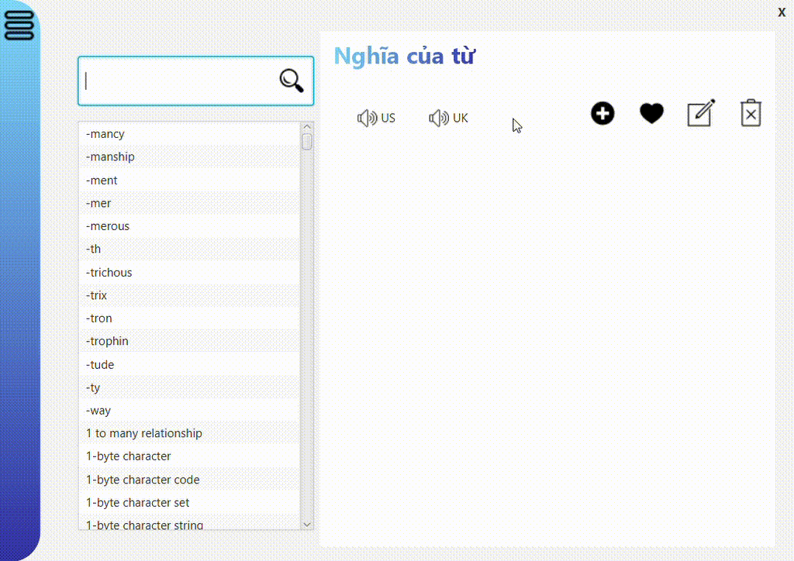

# *BaiTapLon*
# Hello bro, welcome to our project about dictionary's app which you can learn new languages and play english game in a new way.
***

## Table of content
1. [Contribute](#Contribute)
2. [Introduce](#Introduce)
3. [Applied_technology](#Applied_technology)
4. [Feature](#Feature)
5. [How_to_install](#How_to_install)
***

### Content
1. ### Contribute
    First of all, I will introduce to you about my team. My team has 3 members include: leader [BuiDoKhoiNguyen](https://github.com/BuiDoKhoiNguyen), two members [quan29117](https://github.com/quan29117) and [dbaothang](https://github.com/dbaothang)
2. ### Introduce 
   Welcome to our innovative Dictionary Application, where learning English becomes an engaging and interactive experience. We've designed a feature-packed app that not only serves as your go-to dictionary but also adds an element of fun to your language learning journey.
3. ### Applied_technology
   Our project utilizes Java, JavaFX, and SceneBuilder to create a feature-rich dictionary application. By seamlessly integrating with a database server, employing multithreading in programming, and leveraging Google's API for paragraph translation, we've crafted a robust platform that enhances the language learning experience.

4. ### Feature
   Outline about my project, it has some funtions like: search word, add favourite word, watch your profile, translate paragraph, make your own account, play and learn word from our game and so on.I don't want to reveal all the functional details, just trying to discover our dictionary app, and hope you have enjoyable time with it. Here is demo about our project:

   

   
5. ### How_to_install
   My team all use Windows operating system so I can only tell you how to install on this operating system, i'm very sorry if you use another operating system. So to run this project you must install ([javaFx for intelliji](https://www.youtube.com/watch?v=Ope4icw6bVk&list=PLZPZq0r_RZOM-8vJA3NQFZB7JroDcMwev&index=2) or [javaFx for eclipse](https://www.youtube.com/watch?v=_7OM-cMYWbQ&list=PLZPZq0r_RZOM-8vJA3NQFZB7JroDcMwev&index=1)) and ([sceneBuilder](https://www.youtube.com/watch?v=-Obxf6NjnbQ&list=PLZPZq0r_RZOM-8vJA3NQFZB7JroDcMwev&index=5)) and you must set VM  and add extra library 

   

   I think that is enough for you to run our project perfectly. Hope you try to install and enjoy, experience, learn new things. If you are new to programming and looking for resources on large projects, you can refer to our source.

***
# All the aspects I've mentioned above provide a comprehensive overview of our team's project. We hope to instill enthusiasm and passion for programming in young minds. Please give us a star, it is a great motivation for us. Thank you all <3 <3 <3.
